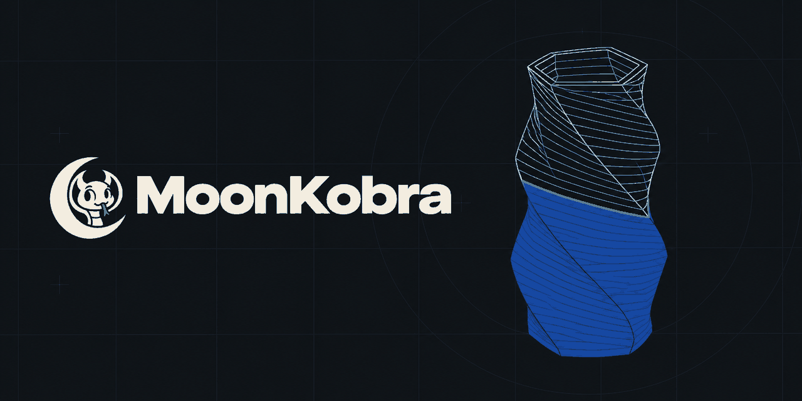
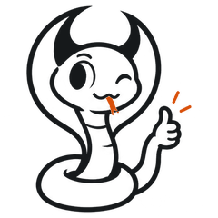
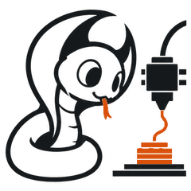
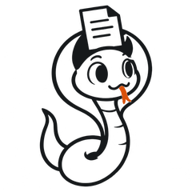
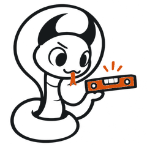
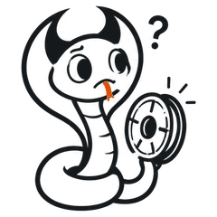
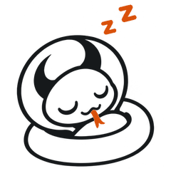

<div align="center">



**Ensine sua Kobra a falar Moonraker.**

Controle a Anycubic Kobra X pelo OrcaSlicer e por um painel web completo,
sem Klipper e sem Raspberry Pi.

[English](README.md) · Português (Brasil)

<sub>O MoonKobra é um fork do KX-Bridge, de viewit.</sub>

</div>

---

## O que é

<picture>
  <source media="(prefers-color-scheme: dark)" srcset="docs/assets/moko/ok-dark.png">
  
</picture>

A Kobra X fala o protocolo de rede local da própria Anycubic (MQTT). Os
fatiadores e as ferramentas do mundo Klipper falam Moonraker. O MoonKobra fica
no meio e traduz, então a impressora aparece como um host Moonraker comum:

```
OrcaSlicer · Obico · Mobileraker · Home Assistant
            │  HTTP + WebSocket (API do Moonraker)
            ▼
       MoonKobra  ── painel web na porta 7125
            │  MQTT pela rede local
            ▼
     Kobra X + ACE (4 slots de filamento)
```

Ele roda em qualquer máquina da mesma rede (PC, NAS, servidor de casa) como
container Docker, binário único ou Python puro. Nada é instalado na
impressora.

**Este é o Moko.** A pequena naja é o mascote do MoonKobra. No painel, o Moko
comenta o que a impressora está fazendo: aquecendo, nivelando, imprimindo,
esperando filamento, terminou ou dormindo quando a impressora está desligada.

---

## Recursos

<picture>
  <source media="(prefers-color-scheme: dark)" srcset="docs/assets/moko/print-dark.png">
  
</picture>

**Impressão**
- Iniciar, pausar, retomar e cancelar; temperaturas, velocidade, ventoinhas,
  movimento e luz.
- Tela "Agora": a peça em 3D *é* a barra de progresso (sólida até a camada
  atual), com as fases que a impressora informa e a tendência das
  temperaturas.
- Parar a impressão exige segurar o botão por 1,4 s, para não acontecer sem
  querer.
- Pular objetos, câmera ao vivo e os códigos de erro da Anycubic em frases
  claras.
- Modos Dia, Noite e Madrugada (vermelho); funciona no PC, no celular, no
  tablet e dentro da aba *Device* do OrcaSlicer.

**Filamento e ACE**
- Slots do ACE com escolha de perfil por slot; material e cor voltam para a
  tela da impressora.
- Importe seus próprios perfis de filamento do OrcaSlicer (ZIP) e reconheça
  carretéis com etiquetas RFID gravadas por outros apps.
- Vários ACE em cadeia, com o secador de cada unidade.
- [Spoolman](https://github.com/Donkie/Spoolman): associe carretéis aos slots
  e o consumo é registrado enquanto imprime.
- Perfis de filamento brasileiros prontos para importar (veja
  [abaixo](#perfis-de-filamento-brasileiros)).

**Arquivos e histórico**
- Navegador de G-code para os arquivos enviados e os que estão na memória da
  impressora, com miniaturas, busca e exclusão em lote.
- Histórico de impressões com um log separado para cada uma, que dá para
  baixar em texto.

**Orçamento (beta)**
- Escolha um G-code e receba o preço: material, purga do ACE, energia,
  desgaste da máquina, mão de obra, reserva para falhas, embalagem, margem,
  imposto e taxas do canal de venda (as duas faixas da Shopee e do Mercado
  Livre). Cupons, desconto por quantidade e peças por mesa.
- Orçamentos salvos e recibo para o cliente em imagem (WhatsApp), PDF ou
  texto. Nenhum custo interno nem margem aparece no recibo.

**E mais**
- Várias impressoras numa instância só; para adicionar basta o IP (as
  credenciais são buscadas na própria impressora).
- Avisos de impressão por ntfy, Discord, Telegram ou qualquer webhook JSON.
- Login com troca de senha obrigatória no primeiro acesso, chave de API para
  fatiadores e token só de câmera para o OBS.
- Liga/desliga por tomada inteligente, backup e restauração da configuração.
- Interface em português do Brasil e inglês, além de alemão, espanhol,
  francês, italiano e chinês parciais.

---

## Começo rápido

<picture>
  <source media="(prefers-color-scheme: dark)" srcset="docs/assets/moko/upload-dark.png">
  
</picture>

**1. Ative o modo LAN na impressora.**
Tela da impressora → Configurações → Ativar modo LAN.

**2. Inicie o MoonKobra.**

*No Windows (o jeito mais fácil, sem instalar nada):*
1. Baixe o `MoonKobra-…-windows.exe` da [última versão](https://github.com/clevim/MoonKobra/releases/latest).
2. Coloque numa pasta só dele, por exemplo `Documentos\MoonKobra`. As
   configurações e os arquivos ficam nessa pasta, ao lado do `.exe`.
3. Dê dois cliques. Se o Windows mostrar *"O Windows protegeu o computador"*,
   clique em **Mais informações → Executar assim mesmo**. Se o firewall
   perguntar, marque **Redes privadas** e clique em **Permitir**.
4. O navegador abre sozinho no painel. A janela preta é o MoonKobra rodando:
   **fechar essa janela desliga tudo**. Para abrir de novo, dois cliques no `.exe`.

*Com Docker (Linux, NAS, servidor):* o Docker constrói a partir desta pasta:

```bash
git clone https://github.com/clevim/MoonKobra.git
cd MoonKobra
./start.sh
```
`docker compose up -d --build` também funciona.

**3. Abra o painel** em `http://IP-DO-HOST:7125`.
O primeiro login é `kx` / `kx123`, e ele pede uma senha nova na hora.

**4. Adicione a impressora.**
Na primeira vez, o painel pergunta só o IP da impressora e o idioma. Depois,
mais impressoras entram por *Impressoras → Adicionar impressora*.
Usuário, senha, ID do dispositivo e o certificado TLS da própria impressora são
lidos dela automaticamente. O certificado fica salvo em `config/certs/`; apague
essa pasta para buscar de novo.

**5. Conecte o OrcaSlicer.**
Impressora → Conexão → tipo **Moonraker**, host `http://IP-DO-HOST:7125` (com
`http://` e a porta). Cole a chave de *Configurações → API* no campo de chave
de API.
O painel mostra esse passo a passo com os seus dados já preenchidos (e em
*Configurações → API → Como conectar o OrcaSlicer*).

> Mais de uma impressora? Adicione do mesmo jeito: cada uma ganha a própria
> porta (7125, 7126, …).

<details>
<summary><b>Outras formas de rodar</b></summary>

**Python direto**
```bash
pip install -r requirements.txt
python kobrax_moonraker_bridge.py
```

**Binário único (Linux ou Windows)**
```bash
pip install pyinstaller
pyinstaller moonkobra.spec      # resultado: dist/moonkobra (ou moonkobra.exe)
```
`config/` e `data/` são criadas ao lado do binário, então copiar a pasta leva
a instalação inteira junto.

**Stack completa (Spoolman + Obico próprio)**
O [`docker-compose.stack.yml`](docker-compose.stack.yml) sobe MoonKobra,
Spoolman, Obico e moonraker-obico juntos. O passo a passo está no cabeçalho
do arquivo.
</details>

---

## Fatiador recomendado

O OrcaSlicer comum fatia e imprime normalmente. Para sincronizar o filamento
por slot (o fatiador escolher o *seu* perfil da marca em vez de
`Generic PLA`), é preciso um build do OrcaSlicer com estes pull requests:

- [#13372](https://github.com/SoftFever/OrcaSlicer/pull/13372): a
  sincronização do AMS mantém a posição dos slots mesmo com slots vazios.
- [#13719](https://github.com/SoftFever/OrcaSlicer/pull/13719): casamento por
  fabricante + nome no Moonraker, de [@LordGuenni](https://github.com/LordGuenni).
- [#13315](https://github.com/SoftFever/OrcaSlicer/pull/13315): `filament_id`
  único para perfis do usuário, de [@mrnoisytiger](https://github.com/mrnoisytiger).

O build comunitário OrcaSlicer-KX já traz os três.

---

## Perfis de filamento brasileiros

<picture>
  <source media="(prefers-color-scheme: dark)" srcset="docs/assets/moko/level-dark.png">
  
</picture>

Em [`profiles/brasil/`](profiles/brasil/) ficam perfis do OrcaSlicer para a
Kobra X (bico 0.4), montados com o que cada fabricante publica: **3DFila**
(132 cores, um perfil por cor, com a cor oficial e o preço da loja),
**GTMax3D** e **3D Lab**. Importe o `filamentos-brasil.zip` no OrcaSlicer ou
direto no MoonKobra (*Configurações → Filamento → Importar perfis*). O
Orçamento usa os preços da 3DFila automaticamente. Detalhes em
[profiles/brasil/README.md](profiles/brasil/README.md).

---

## Integrações

- **[Home Assistant](https://github.com/gangoke/kobrax-lan-hass-component)**,
  de [@gangoke](https://github.com/gangoke): sensores, controles, luz, câmera
  e miniatura como entidades nativas.
- **[Obico](https://github.com/TheSpaghettiDetective/obico-server)** (servidor
  próprio) via [moonraker-obico](https://github.com/TheSpaghettiDetective/moonraker-obico):
  time-lapse e transmissão WebRTC. A detecção de falhas é experimental na
  Kobra X (a câmera fica no alto, diferente do que o modelo aprendeu).
- **Mainsail, Fluidd, Mobileraker**: tudo que fala Moonraker consegue ler o
  estado da impressora e o gráfico de temperatura.

São projetos da comunidade, não mantidos pelo MoonKobra.

---

## Solução de problemas

<picture>
  <source media="(prefers-color-scheme: dark)" srcset="docs/assets/moko/empty-dark.png">
  
</picture>

<details>
<summary><b>"Credenciais MQTT erradas" ao iniciar</b></summary>

Adicione a impressora de novo com *Adicionar impressora*, ou busque as
credenciais à mão e reinicie:
```bash
python fetch_credentials.py --ip 192.168.x.x --write-config
```
Digite só o IP, sem porta (✗ `192.168.1.102:9883`, ✓ `192.168.1.102`).
</details>

<details>
<summary><b>Impressora não encontrada</b></summary>

O modo LAN precisa estar ligado (tela da impressora → Configurações), e a
impressora e o MoonKobra precisam estar na mesma rede.
</details>

<details>
<summary><b>O OrcaSlicer não conecta</b></summary>

O tipo de conexão tem que ser **Moonraker** (não Bambu nem Klipper), o host
precisa ter `http://` e `:7125`, e a chave de *Configurações → API* precisa
estar preenchida.
</details>

<details>
<summary><b>Docker: permissão negada</b></summary>

```bash
sudo usermod -aG docker $USER   # depois saia e entre de novo na sessão
```
</details>

Mais no [manual do usuário](docs/pt-BR/manual.md). Para desenvolvedores, a
[referência da API](docs/api.md) (em inglês).

---

## Segurança

- Deixe o MoonKobra só na sua rede local. **Não exponha a porta 7125 para a
  internet.**
- O `config/config.ini` guarda as credenciais da impressora: não compartilhe.
- Essas credenciais não dão acesso a nenhum serviço de nuvem da Anycubic.

---

## Créditos e licença

[](LICENSE)

O MoonKobra é distribuído sob a **GNU General Public License v3.0**
([LICENSE](LICENSE)). Ele começou como fork do
KX-Bridge, de viewit e
colaboradores; a tabela de códigos de erro da Anycubic vem de
[stribor/anycubic_kobrax](https://github.com/stribor/anycubic_kobrax) (MIT).

O suporte ao protocolo MQTT é fruto de engenharia reversa independente, para
fins de interoperabilidade. O MoonKobra não traz nenhum arquivo da Anycubic: o
certificado TLS usado com a impressora é gerado por ela mesma e entregue pela
rede local. Detalhes em [NOTICE.md](NOTICE.md).

O MoonKobra é independente e não tem ligação com a Anycubic.

<div align="center">
<br>
<picture>
  <source media="(prefers-color-scheme: dark)" srcset="docs/assets/moko/sleep-dark.png">
  
</picture>
<br>
<sub>O Moko foi dormir. Vai imprimir alguma coisa.</sub>
</div>
